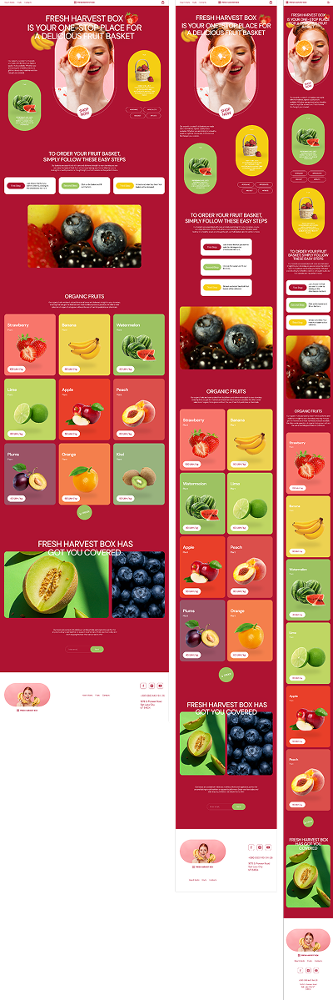

# $\color{darkred}\textsf{FRESH HARVEST BOX}$

$\color{limegreen}\text{Тренировочная работа}$

## $\color{mediumblue}\text{Описание работы }$:

Внешняя часть одностраничного интернет магазина по продаже фруктов.

За основу взят произвольный макет из сети.

**Цели и задачи работы :**

❗Повышение веб-доступности (_accessibility_), на уровне **HTML-структуры** страницы.

❗Использование **CSS**-переменных и универсальных селекторов классов для однотипных блоков.

❗Знакомство с **JS**-библиотекой iziModal и создание модальных окон.

❗Использование **шаблонизации в JS** для формирования HTML-блоков.

❗Имитация работы с **JSON-файлами**, содержащими данные о товарах. И работа с localStorage.

❗**Создание логики** корзины товаров.

❗Работа с формами.

❗Знакомство с **синтаксисом** библиотеки **jQuery**.

🎯 $\color{mediumblue}\textsf{Основная задача }$ - отследить **причины потери производительности** страницы в мобильной версии.

---

Макет -> [**Figma**](https://www.figma.com/design/TSviAPOHlmEuXEII0LzVMP/%D1%84%D1%80%D1%83%D0%BA%D1%82%D1%8B?node-id=0-1&p=f&t=5TeMPYuvQd6hERr1-0)

Вёрстка -> [**Git pages**](https://artiom-work.github.io/fresh-harvest-box/)

---

## $\color{mediumblue}\text{Технологии, инструменты и способы вёрстки }$:

✅ Библиотека iziModal
✅ Библиотека jQuary
✅ SASS
✅ БЭМ
✅ Flex
✅ Grid
✅ Адаптивная вёрстка
✅ Кроссбарузерная вёрстка
✅ Валидная вёрстка
✅ Семантическая вёрстка
✅ Оптимизация
✅ Тестирование (PageSpeed Insights)
✅ Мобильное меню (CSS + JS)
✅ Корзина товаров (CSS + JS + jQuary)
✅ Формы и валидация (HTML + JS)
✅ Git
✅ Figma
✅ SVG-спрайты
✅ Retina
✅ Hover/active эффекты
✅ Pixel Perfect

---

## $\color{mediumblue}\textsf{Что сделано, итоги и выводы:}$

💡 Изучен правильный **способ компоновки заголовков** блоков в HTML путём сокрытия элемента. Внедрены атрибуты **aria-label** для ссылок, атрибуты **title** для кнопок и скрытые теги "label" у полей ввода данных с целью **улучшения веб-доступности**.

💡 Изучены некоторые **способы использования CSS-переменных** внутри CSS-селекторов тегов, а также **глобальных CSS-переменных**, к примеру, переменные для центрирующего блока или отступов.

💡 Изучены **способы создания универсальных селекторов классов** на примере заголовков или кнопок.

💡 Использована **CSS-функция clamp()** для указания адаптивных значений.

💡 Для создания модальных окон **использована библиотека iziModal**, доработанная с помощью **CSS** и **JS**. Открытие модальных окон реализовано после ввода валидных значений в полях формы.

💡 На страницу добавлены формы со стандартной валидацией полей через JS.

💡 Добавлена маска для поля ввода значений платёжной карты.

💡 **Товары и корзина** товаров (_имитация_):

    	✅ Данные о товарах приходят на страницу из JSON-файлов.
    	✅ При клике на товар он дублируется в корзине товаров с увеличением счётчика.
    	✅ Для формирования данных о товаре используется localStorage.
    	✅ Корзина товаров реализована в выпадающем окне и привязана к форме с полями ввода типа checkbox.
    	✅ Реализована возможность удаления товара по клику из корзины с уменьшением счётчика.
    	✅ Реализовано отображение выбранных пользователем товаров после имитированной отправки данных на сервер.

💡 **Рефакторинг JS-кода**.

    	✅ Глобальные переменные вынесены в начало файла.
    	✅ Добавлены комментарии для пояснения назначения различных частей кода.
    	✅ Код разбит на логические блоки.
    	✅ Удалены неиспользуемые переменные.
    	✅ Произошло некоторое переформатирование, чтобы сделать код более консистентным.

💡 Выполнена работа по улучшению **специальных возможностей** и **поисковой оптимизации** по рекомендациям PageSpeed Insights.

💡 **Валидация** HTML и CSS. **Минификация и компрессия** JS-файла и CSS-файла.

💡 **Изменение производительности отслеживалось** поэтапно на протяжении вёрстки всей страницы:

    1.  Added header and mobile menu.

    				Performance in mobile = 100%
    				Performance in desktop = 100%

    2.  Added footer.

    				Performance in mobile = 100%
    				Performance in desktop = 100%

    3.  Added promo.

    				Performance in mobile = 98%
    				Performance in desktop = 100%
    					2% optimization stole js file

    4.  Added how-it-works.

    				Performance in mobile = 98%
    				Performance in desktop = 100%

    5.  Added quick-order.

    				Performance in mobile = 98%
    				Performance in desktop = 100%

    6.  Added products.

    				Performance in mobile = 98%
    				Performance in desktop = 100%

    7.  Added modal window "thank you".

    				Performance in mobile = 96%
    				Performance in desktop = 100%
    					1% steals the iziModal library style file
    								and
    					1% steals the iziModal library js file

    8.  Added modal window "user order".

    				Performance in mobile = 94%
    				Performance in desktop = 100%
    					2% optimization steals images in modal windows and css code

    9.  Refactoring js code

    				Performance in mobile = 96%
    				Performance in desktop = 100%

    10. Added retina for images in promo block. Inline HTML srcset for tags img , sourse srcset for tag picture and image-set in css.

    				Performance in mobile = 87% (retina HTNL + CSS)
    				Performance in desktop = 100%

    				Performance in mobile = 95% (retina CSS only)
    				Performance in desktop = 100%

    				Performance in mobile = 95% (retina HTNL + CSS + lazy loading)
    				Performance in desktop = 100%

    11. Added retina for images in section products.

    				Performance in mobile = 94% (retina HTNL + lazy loading)
    				Performance in desktop = 100%

    12. Added retina for images in section quick oreder.

    				Performance in mobile = 92% (retina HTNL + lazy loading)
    				Performance in desktop = 100%

    13. Added retina for images in footer

    				Performance in mobile = 96% (retina HTNL + lazy loading)
    				Performance in desktop = 100%

    14. Added retina for images and lazy loading. all page

    				Performance in mobile = 92%
    				Performance in desktop = 100%
    					retina and lazy loading steals 4 percent of productivity

    15. Minification and compression js and css files ( + 3% Performance)

    				Performance in mobile = 95%
    				Performance in desktop = 100%

💡 $\color{mediumblue}\textsf{Итоги наблюдения за изменением производительности мобильной версии }$

Потери производительности:

    	❌ Retina в HTML
    	❌ Изображения без чёткого размера
    	❌ Неоптимизированные изображения
    	❌ Не форматированные изображения
    	❌ Использование JS
    	❌ Использование библиотеки iziModal для модальных окон

Методы для улучшения производительности:

    	✅ Использование форматов изображений WebP
    	✅ Сжатие изображений
    	✅ Указание размеров для изображений в HTML (inline)
    	✅ Использование атрибута loading со значением "lazy" для тегов 
    	✅ Рефакторинг JS-кода (уменьшение запросов на сервер, удаление лишнего кода)
    	✅ Минификация и компрессия CSS и JS-файлов

---
